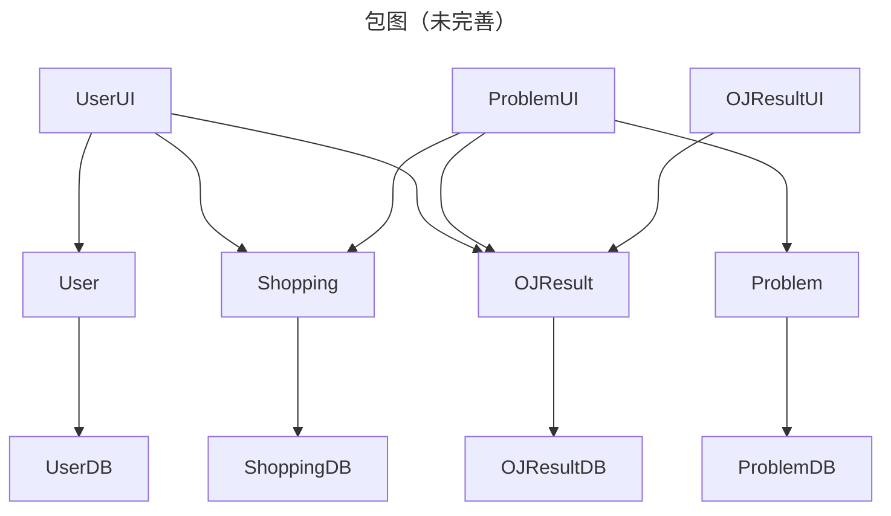
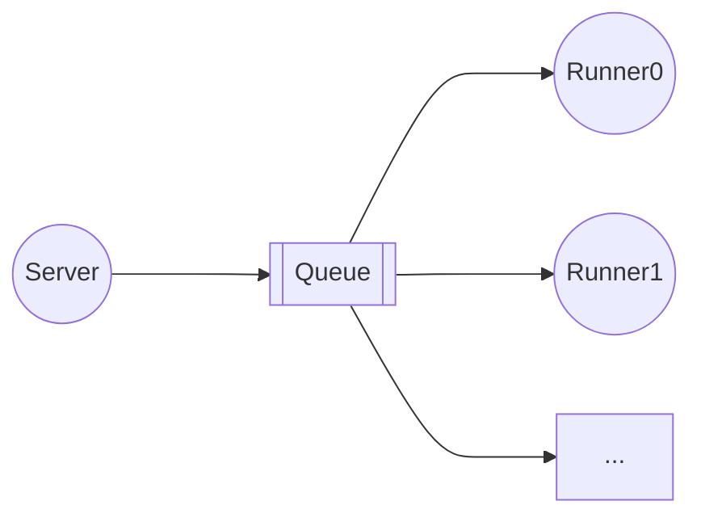
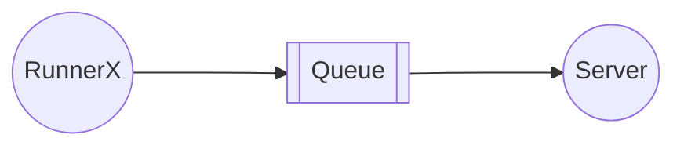

<h1 align="center">Supercode</h1>

## 用户管理

**用户表**

| 字段     | 数据类型                 | 描述         |
| -------- | ------------------------ | ------------ |
| uid      | auto_generate            | 用户唯一标识 |
| username | String(unique, not null) | 用户名       |
| password | String(not null)         | 密码         |
| email    | String(not null)         | 邮箱         |
| role     | String(枚举类Serialize)  | 用户身份     |

用户身份：超级管理员，管理员，普通用户

### 超级管理员

> 别名：`root`

简介：这是系统创建时自动创建的初始管理员，拥有**最高权力**。

超级管理员可以获取、新建、删除和修改所有用户信息，

### 管理员

> 别名：`admin`

简介：管理员身份由超级管理员/管理员赋予普通用户，也可被超级管理员降级为普通用户

管理员可以获取、新建所有用户信息，管理员可以修改和删除普通用户的信息。

### 普通用户

| 别名：`user`

简介：普通用户由管理员/超级管理员创建，可以修改自己的信息(uuid, role字段除外)

## 代码评测

**评测记录表**

| 字段            | 数据类型                | 描述                                       |
| --------------- | ----------------------- | ------------------------------------------ |
| submit_id       | auto_generate           | 提交记录唯一标识                           |
| user_id         | foreign_key             | 提交用户唯一标识                           |
| problem_id      | foreign_key             | 题目唯一标识                               |
| language        | String(枚举类)          | 编程语言                                   |
| code            | String                  | 代码                                       |
| time            | Int                     | 运行时间                                   |
| memory          | Int                     | 内存占用                                   |
| result          | String(枚举类Serialize) | 评测结果                                   |
| stdin           | `List<String>`          | 标准输入                                   |
| stdout          | `List<String>`          | 标准输出                                   |
| stderr          | `List<String>`          | 标准错误输出                               |
| exit_code       | `List<Int>`             | 退出码（部分未被测试的测试点均被设置为-1） |
| submission_time |                         | 提交时间                                   |

**题目内容表**

| 字段        | 数据类型       | 描述             |
| ----------- | -------------- | ---------------- |
| problem_id  | auto_generate  | 题目唯一标识     |
| title       | String         | 标题             |
| description | String         | 描述             |
| stdin       | `List<String>` | 样例标准输入     |
| stdout      | `List<String>` | 样例标准输出     |
| stderr      | `List<String>` | 样例标准错误输出 |

**题目测试表**

| 字段         | 数据类型       | 描述             |
| ------------ | -------------- | ---------------- |
| problem_id   | foreign_key    | 题目唯一标识     |
| time_limit   | Int            | 时间限制         |
| memory_limit | Int            | 内存限制         |
| stdin        | `List<String>` | 标准输入         |
| stdout       | `List<String>` | 正确标准输出     |
| stderr       | `List<String>` | 正确标准错误输出 |

超级管理员，管理员，普通用户均可以提交代码进行评测

代码评测作为`Runner`分布式地部署在不同服务器的不同端口。对于编译型语言，在本机进行编译和构建，然后使用docker运行；对于解释型语言，直接在docker运行。

限制每位用户的提交次数限制，如每分钟3次

后端与Runner通过消息队列进行请求和通信。

**评测请求**

**评测结果返回**

## 付费内容

**题目权限表**

| 字段       | 数据类型    | 描述                     |
| ---------- | ----------- | ------------------------ |
| problem_id | foreign_key | 题目唯一标识             |
| price      | Int         | 价格（单位：S币(bushi)） |
| grade      | Int         | 题目级别                 |

**用户题目解锁表**

| 字段               | 数据类型       | 描述                   |
| ------------------ | -------------- | ---------------------- |
| user_id            | foreign_key    | 用户唯一标识           |
| purchased_problems | `List<String>` | 解锁的题目唯一标识列表 |

**用户级别表**

| 字段    | 数据类型    | 描述         |
| ------- | ----------- | ------------ |
| user_id | foreign_key | 用户唯一标识 |
| grade   | Int         | 用户级别     |

普通用户只能体验**题目级别**小于等于自己**用户级别**的题目。

对于未解锁🔓的题目，普通用户可以通过**付费购买**题目，或者提高自身的**用户级别**来实现做题。

> 可拓展内容：题目激活码，消费优惠券

