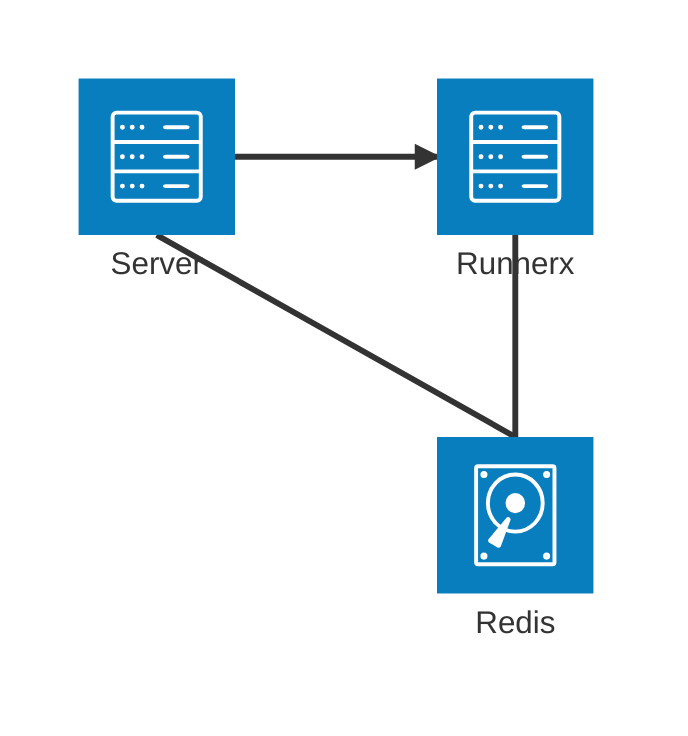
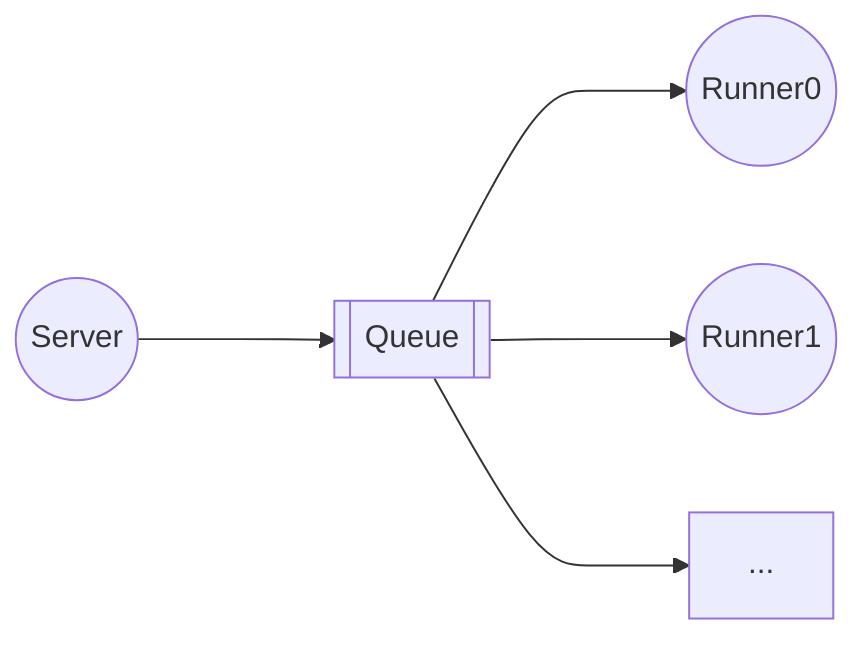
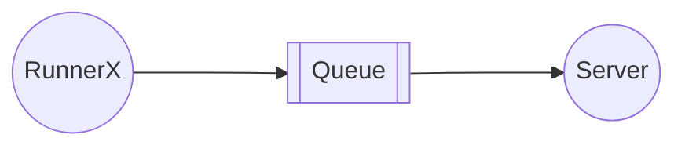

<h1 align="center">Supercode</h1>

# 需求文档

## 架构图




## 用户管理

**用户表**

| 字段     | 数据类型                 | 描述         |
| -------- | ------------------------ | ------------ |
| uid      | auto_generate            | 用户唯一标识 |
| username | String(unique, not null) | 用户名       |
| password | String(not null)         | 密码         |
| nickname | String(not null)         | 用户昵称     |
| email    | String(not null)         | 邮箱         |
| role     | String                   | 用户身份     |

用户身份：超级管理员，管理员，普通用户

### 超级管理员

> 别名：`root`

简介：这是系统创建时自动创建的初始管理员，拥有**最高权力**。

超级管理员可以获取、新建、删除和修改所有用户信息，

### 管理员

> 别名：`admin`

简介：管理员身份由超级管理员赋予普通用户，也可被超级管理员降级为普通用户

管理员可以获取、新建所有用户信息，管理员可以修改和删除普通用户的信息。

### 普通用户

> 别名：`user`

简介：普通用户由管理员/超级管理员创建，可以修改自己的信息(uuid, role字段除外)

## 代码评测

**评测记录表**

| 字段            | 数据类型                              | 描述                                       |
| --------------- | ------------------------------------- | ------------------------------------------ |
| submission_id       | auto_generate                         | 提交记录唯一标识                           |
| user_id         | foreign_key                           | 提交用户唯一标识                           |
| problem_id      | foreign_key                           | 题目唯一标识                               |
| language        | String(枚举类)                        | 编程语言                                   |
| code            | String                                | 代码                                       |
| time            | Int                                   | 运行时间                                   |
| memory          | Int                                   | 内存占用                                   |
| result          | String(枚举类Serialize)               | 评测结果                                   |
| stdio           | `List<Tuple<String, String, String>>` | 标准输入，输出，错误输出                   |
| submission_time |                                       | 提交时间                                   |

**题目内容表**

| 字段                | 数据类型                              | 描述                           |
| ------------------- | ------------------------------------- | ------------------------------ |
| uuid          | auto_generate                         | 题目唯一标识                   |
| title               | String                                | 标题                           |
| description         | String                                | 描述                           |
| time_limit          | Int                                   | 时间限制                       |
| time_reserved | Int                                   | 时间保留限制                   |
| memory_limit        | Int                                   | 内存限制                       |
| memory_reserved     | Int                                   | 内存保留限制                   |
| large_stack         | Boolean                               | 是否开大栈                     |
| output_limit        | Int                                   | 输出行数限制（0为无限制）      |
| process_limit       | Int                                   | 进程限制（0为无限制）          |
| example_stdio       | `List<Tuple<String, String, String>>` | 样例标准输入，输出，错误输出   |
| stdio               | `List<Tuple<String, String, String>>` | 测试点标准输入，输出，错误输出 |

超级管理员，管理员，普通用户均可以提交代码进行评测

代码评测作为`Runner`分布式地部署在不同服务器的不同端口。对于编译型语言，在本机进行编译和构建，然后使用docker运行；对于解释型语言，直接在docker运行。

限制每位用户的提交次数限制，每10s一次。

后端与Runner通过消息队列进行请求和通信。

**评测请求**



**评测结果返回**



# 接口文档

统一接口前缀：`/api/v1`

## HTTP普通

### 1. 用户登录接口

📍 **URL**

```http
POST /user/login
```

🔧 **请求参数**

| 参数名   | 类型     | 是否必填 | 说明     |
| -------- | -------- | -------- | -------- |
| username | `String` | 是       | 用户名   |
| password | `String` | 是       | 用户密码 |

✅ **返回参数**（`ResultVO<String>`）

| 字段 | 类型      | 说明            |
| ---- | --------- | --------------- |
| code | `int`     | 状态码，200成功 |
| msg  | `String?` | 错误信息        |
| data | `String`  | 用户的token|

📌 **示例**

请求

```json
{
  "username": "root",
  "password": "root"
}
```

响应

```json
{
  "code": 200,
  "msg": null,
  "data": "xxxxxxxxx"
}
```

```json
{
  "code": 401,
  "msg": "用户名或密码错误",
  "data": null
}
```

------

### 2. 获取全部题目简要信息

📍 **URL**

```http
GET /problem
```

🔧 **请求参数**

无

✅ **返回参数**（`ResultVO<List<SimpleProblemVO>>`）

📌 **示例**

```json
{
  "code": 200,
  "msg": null,
  "data": [
    {
      "uuid": "xxxx-xxxx-xxxx-xxxx",
      "title": "两数之和"
    }
  ]
}
```

------

### 3. 获取单个题目详细信息

📍 **URL**

```http
GET /problem/{uuid}
```

🔧 **路径参数**

| 参数名    | 类型     | 是否必填 | 说明    |
| --------- | -------- | -------- | ------- |
| uuid | `String` | 是       | 题目 ID |

✅ **返回参数**（`ResultVO<ProblemVO>`）

**示例**

```json
{
  "code": 200,
  "msg": null,
  "data": {
    "uuid": "xxxx-xxxx-xxxx-xxxx",
    "title": "两数之和",
    "description": "...",
    "example_stdio": [
      ["1 1", "2", ""]
    ],
    "time_limit": 1,
    "memory_limit": 256000
  }
}
```

------

### 4. 提交代码

📍 **URL**

```http
POST /problem/{uuid}
```

🔧 **请求参数**

| 参数名    | 类型     | 是否必填 | 说明       |
| --------- | -------- | -------- | ---------- |
| uuid | `String` | 是       | 题目 ID    |
| lang      | `String` | 是       | 语言       |
| code      | `String` | 是       | 提交的代码 |

✅ **返回参数**（`ResultVO<String>`）

**示例**

```json
{
  "code": 200,
  "msg": null,
  "data": "提交代码成功"
}
```

如果10s内提交过代码，拒绝评测

```json
{
  "code": 403,
  "msg": "提交过于频繁，稍后重试",
  "data": null
}
```

------

### 5. 获取用户信息

📍 **URL**

```http
GET /user
```

🔧 **请求参数**

无

✅ **返回参数**（`ResultVO<RetUserVO>`）

**示例**

```
{
  "code": 200,
  "msg": null,
  "data": {
    "username": "admin",
    "email": "admin@example.com",
    "nickname": "ding"
    "role": "admin"
  }
}
```

------

### 6. 修改用户信息

📍 **URL**

```http
POST /user/updateUser
```

🔧 **请求体**

| 参数名   | 类型     | 是否必填 | 说明   |
| -------- | -------- | -------- | ------ |
| username | `String` | 是       | 用户名 |
| email    | `String` | 是       | 邮箱   |
| nickname | `String` | 是       | 昵称   |

**示例**

```json
{
  "username": "admin",
  "email": "admin@example.com",
  "nickname": "zheng"
}
```

✅ **返回参数**（`ResultVO<String>`）

```json
{
  "code": 200,
  "msg": null,
  "data": "更新信息成功"
}
```

------

### 7. 修改用户密码

📍 **URL**

```http
POST /user/password
```

🔧 **请求体**

| 参数名      | 类型     | 是否必填 | 说明   |
| ----------- | -------- | -------- | ------ |
| oldPassword | `String` | 是       | 旧密码 |
| newPassword | `String` | 是       | 新密码 |

**示例**

```json
{
  "oldPassword": "114514",
  "newPassword": "1919810",
}
```

✅ **返回参数**（`ResultVO<String>`）

```json
{
  "code": 200,
  "msg": null,
  "data": "密码修改成功"
}
```

```json
{
  "code": 401,
  "msg": "旧密码不正确",
  "data": null
}
```
---

### 8. 查询单个评测记录

📍 **URL**

```http
GET /problem/submit/{submitId}
```

✅ **返回参数**

```json
{
  "code": 200,
  "msg": null,
  "data": {
    "lang": "C++",
    "code": "int main() {}",
    "time": 1919,
    "memory": 1145141,
    "result": "答案正确",
    "exitCode": 0,
    "dateTime": "2025-05-25 22:52:49.031323",
    "score": 100
  }
}
```

对于正在评测的记录

```json
{
  "code": 200,
  "msg": null,
  "data": {
    "lang": "C++",
    "code": "int main() {}",
    "memory": null,
    "time": null,
    "result": "正在评测",
    "exitCode": null,
    "dateTime": "2025-05-25 22:52:49.031323",
    "score": null
  }
}
```

对于不存在的记录，返回code 404(Not Found)

```json
{
  "code": 404,
  "msg": "评测记录不存在",
  "data": null
}
```

### 9.查询当前用户所有简略评测记录

**URL**

```http
GET /problem/submit
```

**返回参数**

```json
{
  "code": 200,
  "msg": null,
  "data": [
    {
      "submitId": "xxxx-xxxx-xxxx-xxxx",
      "lang": "C++",
      "time": null,
      "memory": null,
      "result": "正在评测",
      "exitCode": 0,
      "submissionTime": "2025-05-25 22:52:49.031323",
      "score": null
    },
    {
      "submitId": "xxxx-xxxx-xxxx-xxxx",
      "lang": "Python",
      "time": 114,
      "memory": 244000,
      "result": "答案正确",
      "submissionTime": "2025-05-24 22:52:49.031323",
      "score": 100
    }
  ]
}
```

如果发现数组中有正在评测的记录，1s后重新发送请求。

## HTTP管理

统一接口前缀：`/mgr`

### 1. 创建用户

🎈 **URL**

```http
POST /user/create
```

🔨**请求参数**

| 参数名   | 类型     | 是否必填 | 说明   |
| -------- | -------- | -------- | ------ |
| username | `String` | 是       | 用户名 |
| password | `String` | 是       | 密码   |
| email    | `String` | 是       | 邮箱   |
| nickname | `String` | 是       | 昵称   |

✅ **返回参数**

```json
{
  "code": 200,
  "msg": null,
  "data": "创建用户成功"
}
```

```json
{
  "code": 409,
  "msg": "用户名已存在",
  "data": null
}
```

### 2. 删除用户

 **URL**

```http
DELETE /user/{username}
```

✅ **返回参数**

```json
{
  "code": 200,
  "msg": null,
  "data": "删除用户成功"
}
```

```json
{
  "code": 403,
  "msg": "权限不足",
  "data": null,
}
```

```json
{
  "code": 404,
  "msg": "用户不存在",
  "data": null
}
```

### 3. 创建题目

**URL**

```http
POST /problem/create
```

**请求参数**

| 参数名          | 类型                                  | 是否必填 | 说明                           |
| --------------- | ------------------------------------- | -------- | ------------------------------ |
| title           | String                                | 是       | 标题                           |
| description     | String                                | 是       | 描述                           |
| time_limit      | Int                                   | 是       | 时间限制                       |
| time_reserved   | Int                                   | 是       | 时间保留限制                   |
| memory_limit    | Int                                   | 是       | 内存限制                       |
| memory_reserved | Int                                   | 是       | 内存保留限制                   |
| large_stack     | Boolean                               | 是       | 是否开大栈                     |
| output_limit    | Int                                   | 是       | 输出行数限制（0为无限制）      |
| process_limit   | Int                                   | 是       | 进程限制（0为无限制）          |
| example_stdio   | `List<Tuple<String, String, String>>` | 否       | 样例标准输入，输出，错误输出   |
| stdio           | `List<Tuple<String, String, String>>` | 否       | 测试点标准输入，输出，错误输出 |

**返回参数**

```json
{
  "code": 200,
  "msg": null,
  "data": "题目创建成功"
}
```

### 4. 删除题目

**URL**

```http
DELETE /problem/{problemId}
```

**返回参数**

```json
{
  "code": 200,
  "msg": null,
  "data": "题目删除成功"
}
```

```json
{
  "code": 404,
  "msg": "题目不存在",
  "data": null
}
```

### 5. 修改题目

**URL**

```http
PUT /problem
```

**请求参数**

| 参数名        | 类型                                  | 是否必填 | 说明                           |
| ------------- | ------------------------------------- | -------- | ------------------------------ |
| problemId     | String                                | 是       | 题目编号 
| title         | String                                | 是       | 标题                           |
| description   | String                                | 是       | 描述                           |
| time_limit      | Int                                   | 是       | 时间限制                       |
| time_reserved   | Int                                   | 是       | 时间保留限制                   |
| memory_limit    | Int                                   | 是       | 内存限制                       |
| memory_reserved | Int                                   | 是       | 内存保留限制                   |
| large_stack     | Boolean                               | 是       | 是否开大栈                     |
| output_limit    | Int                                   | 是       | 输出行数限制（0为无限制）      |
| process_limit   | Int                                   | 是       | 进程限制（0为无限制）          |
| example_stdio | `List<Tuple<String, String, String>>` | 否       | 样例标准输入，输出，错误输出   |
| stdio         | `List<Tuple<String, String, String>>` | 否       | 测试点标准输入，输出，错误输出 |

**返回参数**

```json
{
  "code": 200,
  "msg": null,
  "data": "修改题目成功"
}
```

```json
{
  "code": 404,
  "msg": "题目不存在",
  "data": null
}
```

### 6. 获取单个题目详细信息

> 管理员也可使用HTTP普通接口，因此可以通过`获取题目简要信息列表`来获得所有题目的`problemId`

**URL**

```http
GET /problem/{problemId}
```

**返回参数**

```json
{
  "code": 200,
  "msg": null,
  "data": {
    "title": "两数之和",
    "description": "给定两个整数，输出它们的和",
    "time_limit": 1,
    "time_reserved": 1,
    "memory_limit": 256000,
    "memory_reserved": 256000,
    "large_stack": false,
    "output_limit": 0,
    "process_limit": 0,
    "example_stdio": [
      ["1 1", "2", ""]
    ],
    "stdio": [
      ["114 514", "1919", ""]
    ]
  }
}
```

```json
{
  "code": 404,
  "msg": "题目不存在",
  "data": null
}
```

## 消息队列RabbitMQ

使用两个`Stream`，名称分别为`Server2Runner`和`Runner2Server`

### Server2Runner

**生产者Producer**

示例：两数之和

```yaml
commands:
- command: sh
  args:
  - -c
  - |-
    echo '#include <iostream>
    using namespace std;
    int main() {
        int a, b;
        cin >> a >> b;
        cout << a << " + " << b << " = " << a + b << endl;
    }' > main.cpp
  input: ''
  config:
    time_limit: 1
    time_reserved: 1
    memory_limit: 256000
    memory_reserved: 4096000
    large_stack: false
    output_limit: 0
    process_limit: 0
- command: g++
  args:
  - main.cpp
  - -o
  - main
  input: ''
  config:
    time_limit: 1
    time_reserved: 1
    memory_limit: 256000
    memory_reserved: 4096000
    large_stack: false
    output_limit: 0
    process_limit: 0
- command: ./main
  args: []
  input: 1 2
  config:
    time_limit: 1
    time_reserved: 1
    memory_limit: 256000
    memory_reserved: 4096000
    large_stack: false
    output_limit: 0
    process_limit: 0
image: gcc:14.2
submit_id: '......'
```

### Runner2Server

**生产者Producer**

示例：两数之和

```yaml
sandbox_results:
- state: Success
  stdout: ''
  stderr: ''
  time: 0
  memory: 1796
- state: Success
  stdout: ''
  stderr: ''
  time: 120
  memory: 73572
- state: Success
  stdout: |
    1 + 2 = 3
  stderr: ''
  time: 0
  memory: 3032
submit_id: '......'
```

## 🚨 错误码说明

| code | 含义              |
| ---- | ----------------- |
| 200  | 成功              |
| 204  | 正在处理          |
| 401  | 未认证 / 登录失效 |
| 403  | 用户权限不足      |
| 404  | 找不到资源        |
| 409  | Conflict资源冲突  |
| 500  | 服务器内部错误    |
