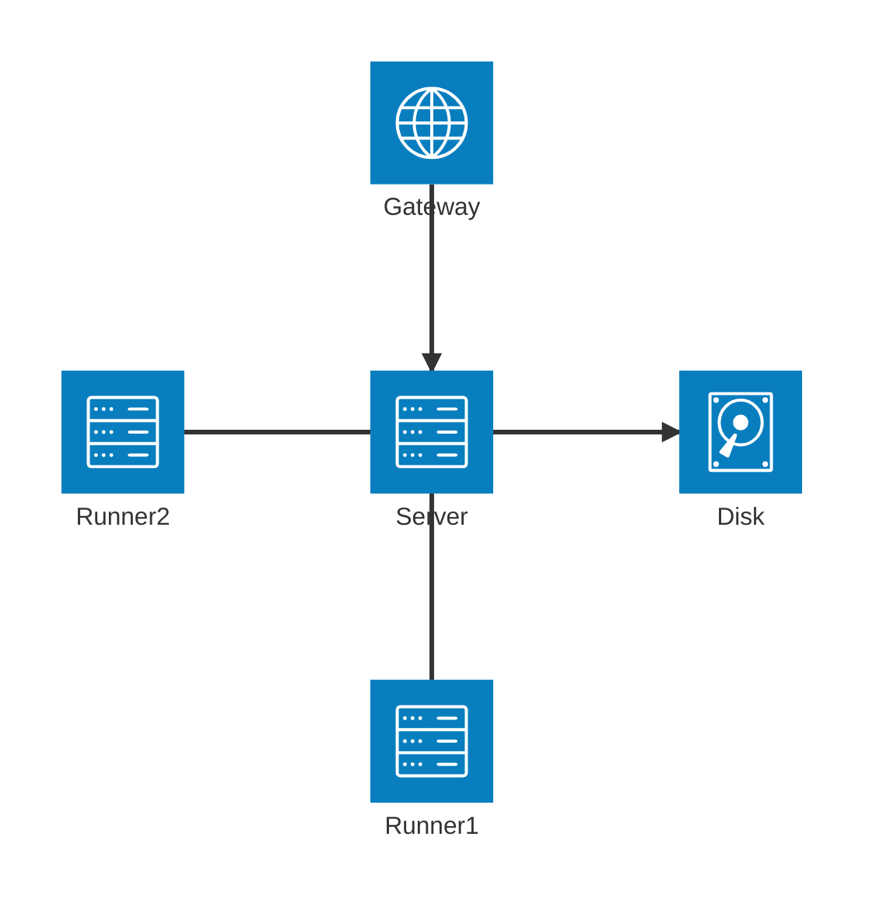
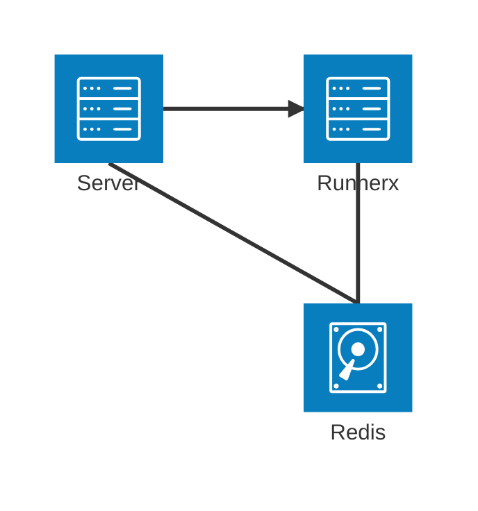
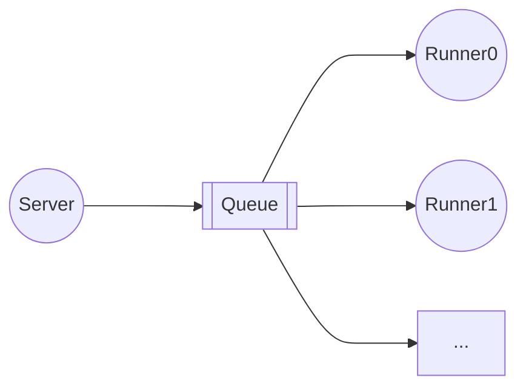
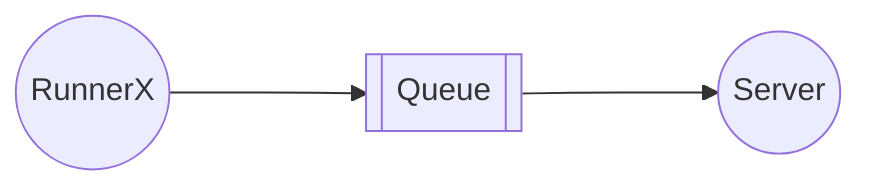

<h1 align="center">Supercode</h1>

# 需求文档

## 架构图





## 用户管理

**用户表**

| 字段     | 数据类型                 | 描述         |
| -------- | ------------------------ | ------------ |
| uid      | auto_generate            | 用户唯一标识 |
| username | String(unique, not null) | 用户名       |
| password | String(not null)         | 密码         |
| email    | String(not null)         | 邮箱         |
| role     | String(枚举类Serialize)  | 用户身份     |

用户身份：超级管理员，管理员，普通用户

### 超级管理员

> 别名：`root`

简介：这是系统创建时自动创建的初始管理员，拥有**最高权力**。

超级管理员可以获取、新建、删除和修改所有用户信息，

### 管理员

> 别名：`admin`

简介：管理员身份由超级管理员/管理员赋予普通用户，也可被超级管理员降级为普通用户

管理员可以获取、新建所有用户信息，管理员可以修改和删除普通用户的信息。

### 普通用户

| 别名：`user`

简介：普通用户由管理员/超级管理员创建，可以修改自己的信息(uuid, role字段除外)

## 代码评测

**评测记录表**

| 字段            | 数据类型                              | 描述                                       |
| --------------- | ------------------------------------- | ------------------------------------------ |
| submit_id       | auto_generate                         | 提交记录唯一标识                           |
| user_id         | foreign_key                           | 提交用户唯一标识                           |
| problem_id      | foreign_key                           | 题目唯一标识                               |
| language        | String(枚举类)                        | 编程语言                                   |
| code            | String                                | 代码                                       |
| time            | Int                                   | 运行时间                                   |
| memory          | Int                                   | 内存占用                                   |
| result          | String(枚举类Serialize)               | 评测结果                                   |
| stdio           | `List<Tuple<String, String, String>>` | 标准输入，输出，错误输出                   |
| exit_code       | `List<Int>`                           | 退出码（部分未被测试的测试点均被设置为-1） |
| submission_time |                                       | 提交时间                                   |

**题目内容表**

| 字段        | 数据类型                              | 描述                         |
| ----------- | ------------------------------------- | ---------------------------- |
| problem_id  | auto_generate                         | 题目唯一标识                 |
| title       | String                                | 标题                         |
| description | String                                | 描述                         |
| stdio       | `List<Tuple<String, String, String>>` | 样例标准输入，输出，错误输出 |

**题目测试表**

| 字段         | 数据类型                              | 描述                         |
| ------------ | ------------------------------------- | ---------------------------- |
| problem_id   | foreign_key                           | 题目唯一标识                 |
| time_limit   | Int                                   | 时间限制                     |
| memory_limit | Int                                   | 内存限制                     |
| stdin        | `List<Tuple<String, String, String>>` | 正确标准输入，输出，错误输出 |

超级管理员，管理员，普通用户均可以提交代码进行评测

代码评测作为`Runner`分布式地部署在不同服务器的不同端口。对于编译型语言，在本机进行编译和构建，然后使用docker运行；对于解释型语言，直接在docker运行。

限制每位用户的提交次数限制，如每分钟3次

后端与Runner通过消息队列进行请求和通信。

**评测请求**



**评测结果返回**



## 付费内容

**题目权限表**

| 字段       | 数据类型    | 描述                     |
| ---------- | ----------- | ------------------------ |
| problem_id | foreign_key | 题目唯一标识             |
| price      | Int         | 价格（单位：S币(bushi)） |
| grade      | Int         | 题目级别                 |

**用户题目解锁表**

| 字段               | 数据类型       | 描述                   |
| ------------------ | -------------- | ---------------------- |
| user_id            | foreign_key    | 用户唯一标识           |
| purchased_problems | `List<String>` | 解锁的题目唯一标识列表 |

**用户级别表**

| 字段    | 数据类型    | 描述         |
| ------- | ----------- | ------------ |
| user_id | foreign_key | 用户唯一标识 |
| grade   | Int         | 用户级别     |

普通用户只能体验**题目级别**小于等于自己**用户级别**的题目。

对于未解锁🔓的题目，普通用户可以通过**付费购买**题目，或者提高自身的**用户级别**来实现做题。

> 可拓展内容：题目激活码，消费优惠券

# 接口文档

统一接口前缀：`/api/v1`

## HTTP

### 1. 用户登录接口

📍 **URL**

```http
POST /user/login
```

🔧 **请求参数**

| 参数名   | 类型     | 是否必填 | 说明     |
| -------- | -------- | -------- | -------- |
| username | `string` | 是       | 用户名   |
| password | `string` | 是       | 用户密码 |

✅ **返回参数**（`ResultVO<bool>`）

| 字段 | 类型      | 说明            |
| ---- | --------- | --------------- |
| code | `int`     | 状态码，200成功 |
| msg  | `string?` | 错误信息        |
| data | `bool`    | 登录是否成功    |

📌 **示例**

请求

```json
{
  "username": "root",
  "password": "root"
}
```

响应

```json
{
  "code": 200,
  "msg": null,
  "data": true
}
```

```json
{
  "code": 401,
  "msg": "用户名或密码错误",
  "data": false
}
```

------

### 2. 获取题目简要信息列表

📍 **URL**

```http
GET /problem
```

🔧 **请求参数**

无

✅ **返回参数**（`ResultVO<List<ProblemBrief>>`）

📌 **示例**

```json
{
  "code": 200,
  "msg": null,
  "data": [
    {
      "problemId": "xxxx-xxxx-xxxx-xxxx",
      "title": "两数之和",
      "difficulty": "Easy"
    }
  ]
}
```

------

### 3. 获取题目详细信息

📍 **URL**

```http
GET /problem/{problemId}
```

🔧 **路径参数**

| 参数名    | 类型     | 是否必填 | 说明    |
| --------- | -------- | -------- | ------- |
| problemId | `string` | 是       | 题目 ID |

✅ **返回参数**（`ResultVO<ProblemDetail>`）

**示例**

```json
{
  "code": 200,
  "msg": null,
  "data": {
    "problemId": "p1",
    "title": "两数之和",
    "description": "...",
    "stdio": [
      ["1 1", "2", ""]
    ]
  }
}
```

------

### 4. 提交代码

📍 **URL**

```http
POST /problem/{problemId}
```

🔧 **请求参数**

| 参数名    | 类型     | 是否必填 | 说明       |
| --------- | -------- | -------- | ---------- |
| problemId | `string` | 是       | 题目 ID    |
| lang      | `string` | 是       | 语言       |
| code      | `string` | 是       | 提交的代码 |

✅ **返回参数**（`ResultVO<bool>`）

**示例**

```json
{
  "code": 200,
  "msg": null,
  "data": true
}
```

------

### 5. 获取用户信息

📍 **URL**

```http
GET /user
```

🔧 **请求参数**

无

✅ **返回参数**（`ResultVO<UserInfo>`）

**示例**

```
{
  "code": 200,
  "msg": null,
  "data": {
    "username": "admin",
    "email": "admin@example.com"
  }
}
```

------

### 6. 修改用户信息

📍 **URL**

```http
POST /user
```

🔧 **请求体**

| 参数名   | 类型     | 是否必填 | 说明    |
| -------- | -------- | -------- | ------- |
| username | `string` | 是       | 题目 ID |
| email    | `string` | 是       | 邮箱    |

**示例**

```json
{
  "username": "admin",
  "email": "admin@example.com"
}
```

✅ **返回参数**（`ResultVO<bool>`）

```json
{
  "code": 200,
  "msg": null,
  "data": true
}
```

------

### 7. 修改用户密码

📍 **URL**

```http
POST /user/password
```

🔧 **请求体**

| 参数名      | 类型     | 是否必填 | 说明   |
| ----------- | -------- | -------- | ------ |
| oldPassword | `string` | 是       | 旧密码 |
| newPassword | `string` | 是       | 邮箱   |

**示例**

```json
{
  "oldPassword": "114514",
  "newPassword": "1919810",
}
```

✅ **返回参数**（`ResultVO<bool>`）

```json
{
  "code": 200,
  "msg": null,
  "data": true
}
```

---

### 8. 查询单个评测记录

📍 **URL**

```http
POST /problem/submit/{submitId}
```

✅ **返回参数**

```json
{
  "code": 200,
  "msg": null,
  "data": {
    "submitId": "...",
    "lang": "C++",
    "code": "int main() {}",
    "memory": 1145141,
    "time": 1919,
    "result": "答案正确",
    "score": 100
  }
}
```

对于正在评测的记录，返回code 204(No Content)

```json
{
  "code": 204,
  "msg": "正在评测",
  "data": null
}
```

对于不存在的记录，返回code 404(Not Found)

```json
{
  "code": 404,
  "msg": "评测记录不存在",
  "data": null
}
```

## Websockets

### 1. 获取用户所有评测记录

📍 **URL**

```
/problem/record/user
```

**解释**

第一步：在数据库查询该用户的所有评测完成的记录，然后在redis查询正在评测的评测记录。返回示例：

```json
[
  {
    "subtmitId": "xxxxxxxx-xxxx-xxxx-xxxxxxxxxxxxxxxx",
    "score": 100,
    "lang": "C++",
    "time": 1145,
    "memory": 1919810,
    "result": "答案正确"
  },
  {
    "submitId": "xxxxxxxx-xxxx-xxxx-xxxxxxxxxxxxxxxx",
    "score": null,
    "lang": "C++",
    "time": null,
    "memory": null,
    "result": "正在评测"
  }
]
```

第二步：注册当前的Websocket handler，消息队列回调请求首先将评测结果写入数据库，并删除redis中的对应记录，回到第一步。

> 这里暂时没有考虑使用懒处理，主要是为了代码统一，后续可以进一步优化性能

# 2. 获取题目所有评测记录

📍 **URL**

```
/problem/record/all/{problemId}
```

**解释**

操作类似[1. 获取用户所有评测记录](#1-获取用户所有评测记录)

**返回示例**

同[1. 获取用户所有评测记录](#1-获取用户所有评测记录)

# 3. 获取用户特定题目所有评测记录

📍 **URL**

```
/problem/record/single/{problemId}
```

**解释**

操作类似[1. 获取用户所有评测记录](#1-获取用户所有评测记录)

**返回示例**

同[1. 获取用户所有评测记录](#1-获取用户所有评测记录)

## 🚨 错误码说明

| code | 含义              |
| ---- | ----------------- |
| 200  | 成功              |
| 204  | 正在处理          |
| 400  | 请求参数错误      |
| 401  | 未认证 / 登录失效 |
| 500  | 服务器内部错误    |
